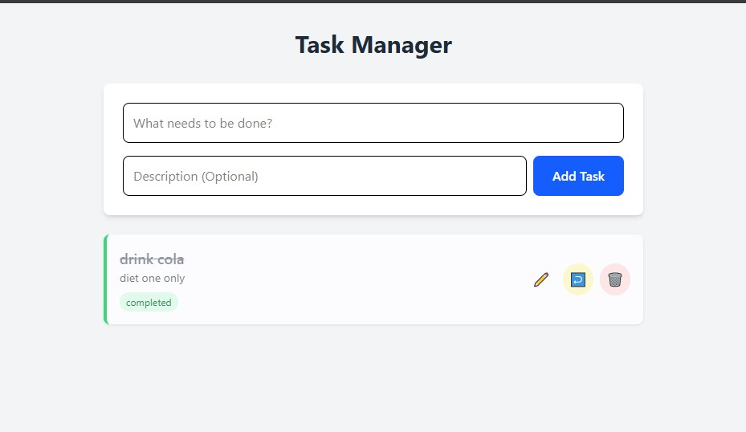

# Simple Task Management App
A full-stack MERN application for managing daily tasks. Built for the Full Stack Internship Assessment.


## 🚀 Features
- **Create Tasks:** Add tasks with a title and description.
- **Read Tasks:** View all tasks in a clean, responsive list.
- **Update Tasks:** Edit task details or toggle status (Pending/Completed).
- **Delete Tasks:** Remove unwanted tasks.
- **Responsive UI:** Built with React & Tailwind CSS.

## 🛠️ Tech Stack
- **Frontend:** React (Vite), Tailwind CSS, Axios, React Hot Toast
- **Backend:** Node.js, Express.js
- **Database:** MongoDB (Mongoose)

## ⚙️ Installation & Setup

### Prerequisites
Make sure you have `Node.js` and `npm` installed.

### 1. Clone the Repository
```bash
git clone https://github.com/Mohdsohaib07/taskManagement.git
```
cd task-management-app
### 2.Backend Setup
cd backend
npm install
backend should run on port 3000
### 3. Frontend Setup
cd frontend
npm install

start the React App:
npm run dev
#frontend should run on http://localhost:5173
